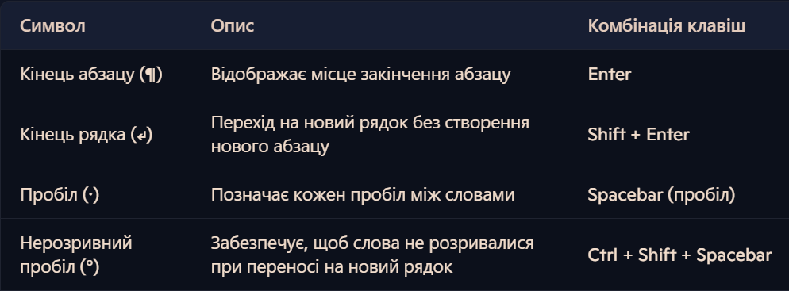

Практична робота 1
1. Запустити текстовий процесор Word
2. Запустити Chrome чи інший браузер і знайти "lorem ipsum"
3. Згенерувати 5 абзаців тексту
4. Скопіювати текст і вставити у Word
5. Відобразити недруковані символи
6. Ввести кілька пробілів.
7. Ввести розрив абзаца (Enter)
8. Ввести нерозривний пробіл (Ctrl+Shift+Пробіл)
9. Продемонструвати як працює нерозривний пробіл
10. Ввести посеред абзаца розрив рядка (Shift+Enter)
11. Пояснити чим відрізняються символ, введений за допомогою Enter
від символа, введеного за допомогою Shift+Enter
12. Навести три випадки, коли замість звичайного пробілу
потрібно використовувати нерозривний пробіл

Практична робота 4
1. Запустити текстовий процесор Word
2. Запустити Chrome чи інший браузер і знайти "lorem ipsum"
3. Згенерувати 5 абзаців тексту
4. Скопіювати текст і вставити у Word
5. Виділити перший абзац, тричі клацнувши лівою кнопкою миші на будь якому слові
6. На виділеному абзаці натиснути праву кнопку миші і вибрати у контекстному меню пункт "Абзац..."
7. Задайте міжрядковий інтервал "1,5 рядки"
8. Аналогічно до попереднього пункту змінити інтервал перед і після абзаца на "36 пт"
9. Виділити частину другого абзаца, натиснути праву кнопку миші і вибрати у контекстному меню пункт "Шрифт...". Змінити колір тексту
10. Виділити текст у кольором за допомогою кнопки "ab" на вкладці "Основне" 
11. Змінити колір сторінки, натиснувши на "Колір сторінки" на вкладці "Конструктор"
12. Виділити частину третього абзаца, натиснути праву кнопку миші і вибрати у контекстному меню пункт "Шрифт...". Перейти на вкладку "Додатково" і змінити інтервал між літерами зі звичайного на розріджений

Практична робота 5
1. Запустити текстовий процесор Word
2. Запустити Chrome чи інший браузер і знайти "lorem ipsum"
3. Згенерувати 5 абзаців тексту
4. Скопіювати текст і вставити у Word
5. Виділити перший абзац і застосувати до нього стиль "Заголовок 1" із вкладки "Основне"
6. До другого абзаца застосувати стиль "Заголовок 2"
7. До третього абзаца застосувати стиль "Сильне виокремлення"
8. До четвертого абзаца застосувати стиль "Цитата"
9. Виділити п'ятий абзац і змінити усі букви у ньому на великі, натиснувши кнопку "Aa" на вкладці "Основне"
10. Перейти на новий абзац у кінці тексту і створити маркований список кнопкою Маркери на вкладці "Основне"
11. Ввести перший рядок списку і натиснути Enter, ввести інші рядки списку
12. Створити нумерований список аналогічно до маркованого

Практична робота 6
1. Запустити текстовий процесор Word
2. Створити таблицю із трьома рядками і трьома стовпцями: вкладка Вставлення -> Таблиця -> "Вставити таблицю..."
3. Виділити перші дві клітинки першого стовпця і об'єднати їх, натиснувши праву клавішу миші і вибравши "Об'єднати клітинки"
4. Додати новий рядок, натиснувши праву клавішу миші і вибравши "Вставити" -> "Вставити рядки знизу"
5. Видалити останній стовпець, натиснувши праву клавішу миші у довільній клітинці цього стовпця і вибравши "Видалити клітинки..." -> "Видалити весь стовпець"
6. У першу клітинку першого стовпця ввести довільний короткий текст
7. Вирівняти текст по центру, скориставшись відповідною кнопкою на вкладці "Основне"
8. Натиснути в кінці тексту правою клавішею миші і вибрати пункт "Властивості таблиці..." із контекстного меню
9. На вкладці Клітинка встановити вертикальне вирівнювання по центру
10. Натиснути в кінці тексту правою клавішею миші і вибрати пункт "Напрям тексту..." із контекстного меню
11. Встановити вертикальну орієнтацію тексту
12. Змінити розміри клітинки, перетягуючи межу між рядками так, щоб текст у клітинку вмістився без перенесень

Практична робота 7
1. Запустіть Chrome чи інший браузер, відкрийте анонімне вікно і зайдіть на сайт drive.google.com
2. Залогіньтесь за допомогою електронної пошти gmail
3. Створіть текстовий документ за допомогою кнопки "Створити" -> "Google документи"
4. Відкрийте нову вкладку в браузері і знайдіть "lorem ipsum"
5. Згенеруйте 5 абзаців тексту 
6. Скопіюйте текст в Google документ
7. Змініть назву документа, натиснувши на поточну назву "Документ без назви"
8. Натисніть на кнопку "Поділитися"
9. Додайте gmail адресу Вашого друга в полі "Додавайте людей, групи й події в календарі"
10. Значення поля "Загальний доступ" змініть із "Може переглядати" на "Може редагувати"
11. Надішліть посилання на документ другові
12. Спробуйте спільно редагувати документ
